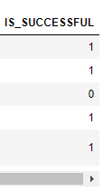
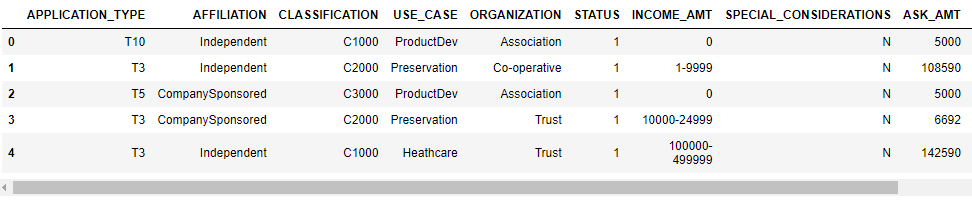
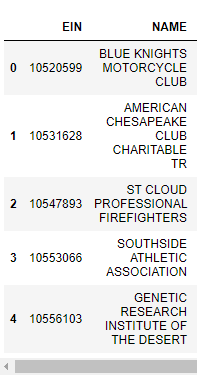
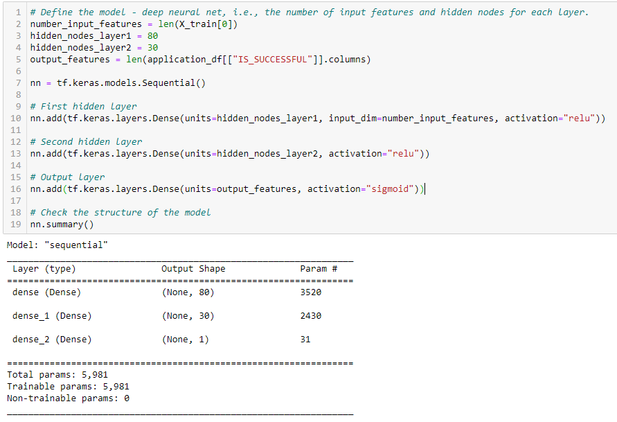
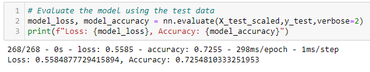
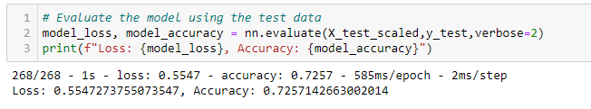
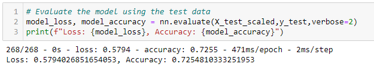
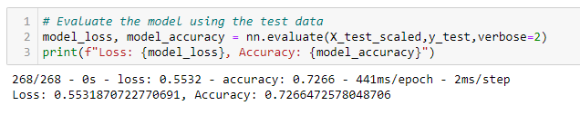
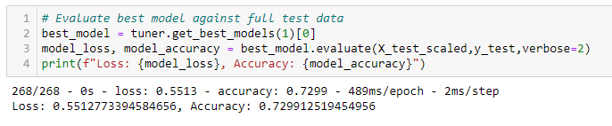

# Neural_Network_Charity_Analysis

## **Overview of Neural_Network_Charity_Analysis**

Using the knowledge of machine learning and neural networks to help Beks create a binary classifier that is capable of predicting whether applicants will be successful if funded by Alphabet Soup. 

## **Results**

- **Data Preprocessing**

   * What variable(s) are considered the target(s) for your model?
   
      * The values of IS_SUCCESSFUL are considered as the targets for my model.
      
        
  
   * What variable(s) are considered to be the features for your model?
   
      * The values of APPLICATION_TYPE, AFFILIATION, CLASSIFICATION, USE_CASE, ORGANIZATION, STATUS, INCOME_AMT, SPECIAL_CONSIDERATIONS, and ASK_AMT are considered as the features for my model.
      
        
   
   * What variable(s) are neither targets nor features, and should be removed from the input data?
   
      * The values of EIN and NAME are neither targets nor features and should be removed from the input data.
      
           
   
- **Compiling, Training, and Evaluating the Model**
  
   * How many neurons, layers, and activation functions did you select for your neural network model, and why?
   
      * Two hidden layers were selected for the initial model because we wanted to use the deep learning neural network. 
      
      * 80 neurons were used for the first hidden layer. This was based on the good rule of thumb for a basic neural network which suggests two to three times the amount of neurons in the hidden layer as the number of inputs. The number of neurons was cut down to 30 in the second layer. 
      
      * ReLU function was used for the first and second layers because the ReLU function is ideal for looking at positive nonlinear input data for classification or regression.
      
      * Sigmoid function was used for the output layer because the sigmoid function values are normalized to a probability between 0 and 1, which is ideal for binary classification. 
      
         
  
   * Were you able to achieve the target model performance?

      * The target model performance was not achieved in the initial model. The accuracy was about 72.55%.
      
         
        
   * What steps did you take to try and increase model performance?
   
      * 1st Attempt: Dropped ASK_AMT column due to a large number of outliers. The accuracy was slightly increased to 72.57%.
      
        
        
      * 2nd Attempt: Increased the number of hidden layers and neurons; also increased the epoch to 200. The accuracy was reverted to 72.55%.
      
        
        
      * 3rd Attempt: Reverted the number of hidden layers and neurons; also reverted epoch to 100. Changed the activation function to "tanh". The accuracy was increased to 72.66%.
      
        
        
      * 4th Attempt: Used "keras-tuner" to search for the best model. The accuracy was increased to 72.99%
      
        

## **Summary**

- **The overall results:**

  * Based on the results, the best deep learning model found by the "keras-tuner" has reached the highest accuracy score of 72.99%. Further modifications are needed to increase the accuracy score in order to reach the target performance.

- **Conclusion:**

  * The deep learning model doesn't seem to be a good fit for this dataset. Since our goal is to create a binary classifier, we can try to use Random forest classifier due to its ability to handle outliers and nonlinear data. With a sufficient number of estimators and tree depth, a random forest model should perform at a similar capacity to most deep learning models.  
